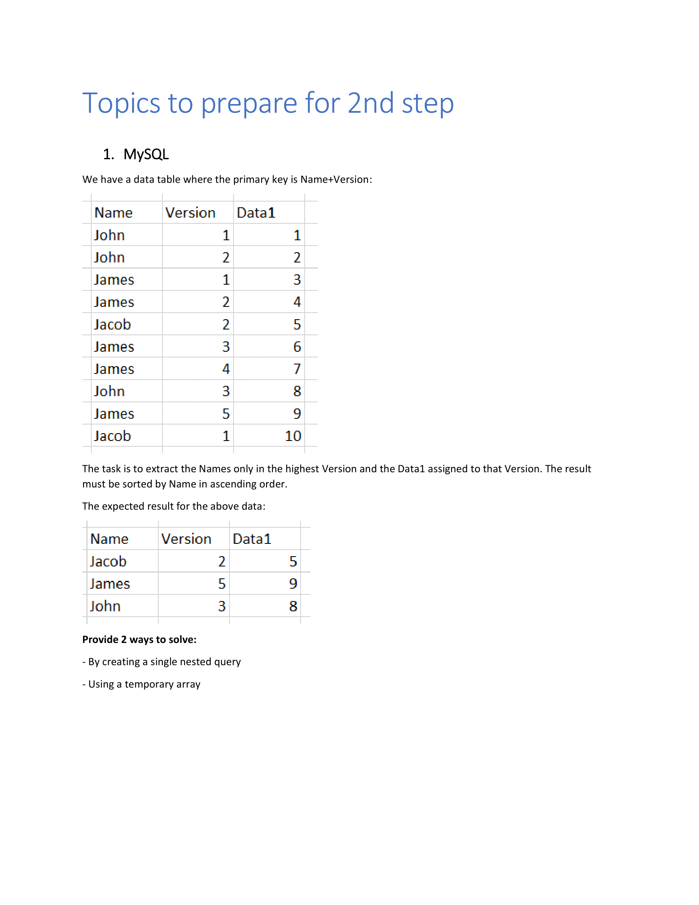
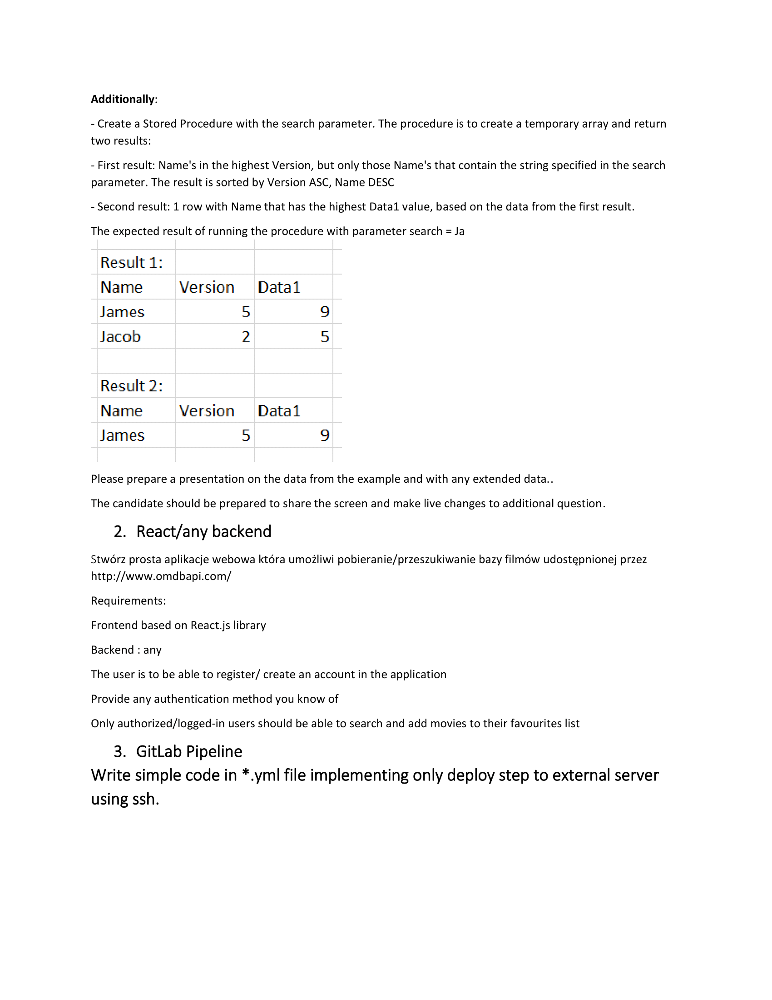

<!-- PROJECT LOGO -->
 

  

<h3 align="center">Recruitment tasks</h3>

  

   
     
    <a href="#task1">Task 1</a>
    ·
    <a href="#task2">Task 2</a>
    ·
    <a href="#task3">Task 3</a>
     
  

<!-- ABOUT THE PROJECT -->
## About The Project
Recruitment tasks for get FullStack JavaScript developer

<!-- ABOUT THE PROJECT -->
 
 

(<a href="#top">back to top</a>)

